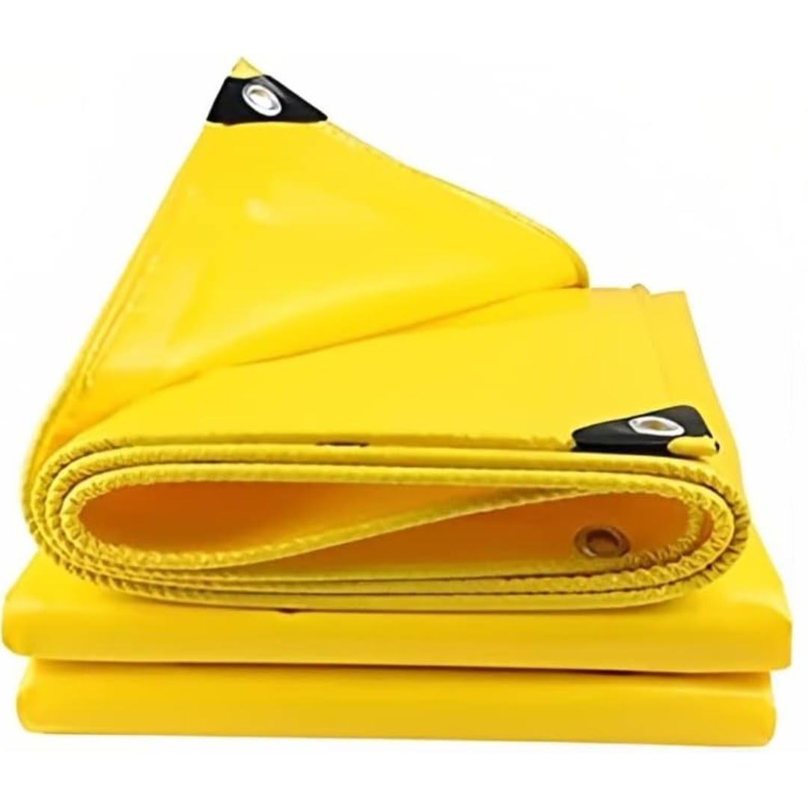

# SEO Guide — Akash Enterprises

## Current SEO Setup (v2.0)

Every page has:
- ✅ `<title>` — under 60 chars, keyword-first
- ✅ `<meta name="description">` — under 155 chars, action verb + value prop
- ✅ `<link rel="canonical">` — prevents duplicate content penalties
- ✅ Open Graph tags — proper WhatsApp/social previews
- ✅ JSON-LD structured data — rich results in Google
- ✅ `loading="lazy"` on all images — better Core Web Vitals
- ✅ `sitemap.xml` — 41 pages submitted to Google
- ✅ `robots.txt` — allows all crawlers
- ✅ Breadcrumb nav + BreadcrumbList schema — hierarchy signals
- ✅ LocalBusiness schema on homepage — Google Business Panel signals

---

## Keyword Strategy

### Tier 1 — Primary (High volume, compete over time)
- `industrial tarpaulin supplier India`
- `HDPE tarpaulin bulk buy`
- `PP rope India`
- `packaging material supplier`

### Tier 2 — Secondary (Medium volume, realistic wins)
- `HDPE tarpaulin for construction site`
- `agro shade net for greenhouse`
- `BOPP tape bulk order India`
- `industrial stretch film supplier`
- `nylon rope marine India`

### Tier 3 — Long-tail (Low volume, high conversion)
- `buy HDPE tarpaulin online bulk India`
- `agro shade net clips UV stabilized`
- `geo membrane tarpaulin pond lining`
- `PP sutli twine agricultural use`
- `anti skid floor marking tape warehouse`

---

## Meta Title Rules

| Rule | Requirement |
|------|------------|
| Max length | 60 characters |
| Format | `[Product/Category] – [Descriptor] \| Akash Enterprises` |
| Keyword position | Primary keyword in first 30 characters |
| Brand | Always end with `\| Akash Enterprises` |

**Good:** `HDPE Tarpaulin – Waterproof Sheets \| Akash Enterprises` (55 chars)  
**Bad:** `Akash Enterprises HDPE Tarpaulin Heavy Duty Waterproof Sheets India` (68 chars)

---

## Meta Description Rules

| Rule | Requirement |
|------|------------|
| Max length | 155 characters |
| Must include | Primary keyword, key benefit, soft CTA |
| Tone | Factual, professional |

---

## Structured Data Types in Use

| Page type | Schema type |
|-----------|-------------|
| Homepage | `LocalBusiness` + `WebSite` |
| Product pages | `Product` + `BreadcrumbList` |
| Category pages | `BreadcrumbList` |

---

## Google Search Console Actions

1. Go to [search.google.com/search-console](https://search.google.com/search-console)
2. Add property: `akash-enterprises.vercel.app`
3. Verify ownership (HTML tag or DNS)
4. Submit sitemap: `https://akash-enterprises.vercel.app/sitemap.xml`
5. Request indexing for homepage first, then top products

---

## Monthly SEO Checklist

- [ ] Check Google Search Console for crawl errors
- [ ] Review which pages got impressions — improve click-through rate on those
- [ ] Update `lastmod` in sitemap.xml if any pages were changed
- [ ] Add FAQ content to product pages — these get `FAQPage` schema eligibility
- [ ] Check Core Web Vitals report in Search Console

---

## Image SEO

Every image should have:
- `alt` text describing what's in the image (not just the product name)
- `loading="lazy"` (except logo which has `loading="eager"`)
- `width` and `height` attributes to prevent layout shift

Example:
```html
<!-- Good -->


<!-- Bad -->

```
